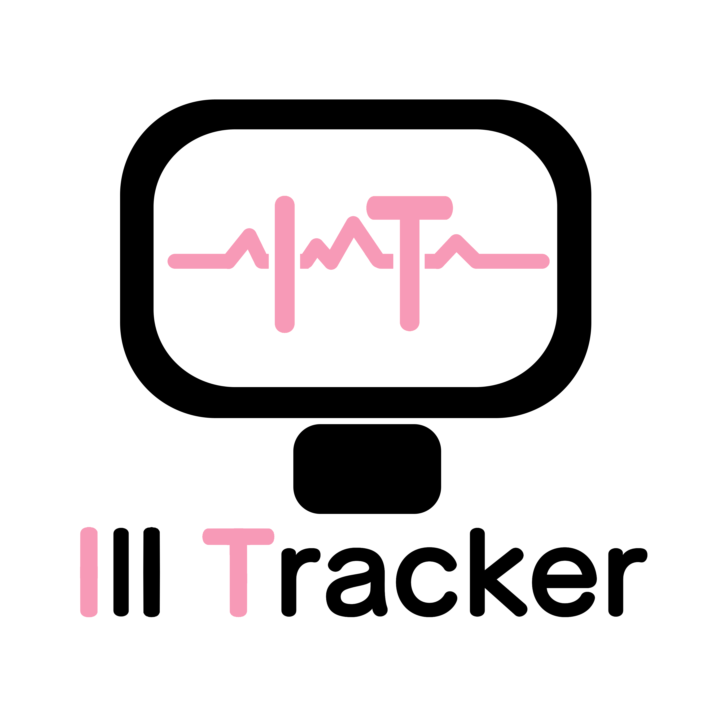

# Illtracker

Repósitorio e informações de instalação do site de apresentação do projeto [Illtracker]
link do repositorio: https://github.com/Henriquedbrito/GsWebDevFront

## sumário

## Sumário
- [Integrantes](#Integrantes-da-Equipe)
- [Info de acesso](#Informações-de-Acesso)
- [Passo a passo para execução](#Passos-para-Executar-o-projeto)
- [Login](#login-e-uso)
- [Importante](#notas-importantes)
## Integrantes da Equipe

- [Henrique de brito costa], RM98831
-  [Pedro Zilves Hissa Quaresma Romão], RM99482

## Informações de Acesso

Abaixo estão os detalhes dos usuários cadastrados para acessar o sistema:

1. **Usuário:** Alê
   - **Email:** alexandreJesus@gmail.com
   - **Senha:** pf0670

2. **Usuário:** Luis
   - **Email:** LuisCarlos@gmail.com
   - **Senha:** cl0133

3. **Usuário:** Zedro
   - **Email:** pedrozilves@gmail.com
   - **Senha:** 0904

4. **Usuário:** Henriquedbrito
   - **Email:** henriqueBrito@gmail.com
   - **Senha:** abacaixiComPeixe
## Instruções de Acesso

Para acessar o sistema, siga os passos abaixo:

### Pré-Requisitos

- Git Bash instalado.
- Node.js instalado.

### Passos para Executar o Projeto

1. **Baixar o Projeto:**
   - Faça o clone ou download deste repositório para a sua máquina local.

2. **Instalar Dependências:**
   - Navegue até a pasta `siteFront` do projeto usando o Git Bash.
   - Execute o comando `npm install` para instalar todas as dependências necessárias.

3. **Executar a API:**
   - Ainda na pasta `siteFront`, execute o comando `npm run churros`. Isso iniciará a API do site.

4. **Executar o Frontend:**
   - Abra outro terminal do Git Bash na mesma pasta.
   - Execute o comando `npm run dev`. Isso iniciará o servidor de desenvolvimento.

5. **Acessar o Site:**
   - Abra o navegador e acesse o link fornecido pelo Git Bash (geralmente algo como `http://localhost:3000`).

## Login e Uso

- Na página de login, use os emails e senhas fornecidos acima.
- Após o login, você será redirecionado para a página inicial, onde encontrará informações sobre nosso projeto.
- Para sair, clique no botão de logout próximo às suas informações de usuário. Isso o redirecionará para a página de login novamente.

## Notas Importantes

- Certifique-se de que todas as informações de acesso estejam corretas para evitar problemas no acesso ao projeto.
- Em caso de dúvidas ou problemas, entre em contato com os integrantes da equipe.
-Deixar o zoom do navegador em 100%

